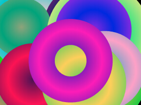



## Gradient Circles v1\.2\.0

### Description

I wrote GradientCircles a few years ago as part of a larger project. It has always been one of my favorite Graphics programs. But then I'm a sucker for colorful random graphics. I've seen some other interesting graphic displays on PSC that are based on a specific formula or pattern, so that once you see it.... you've seen it. In other words, it does one thing nicely, but that's the only thing it can do.

GradientCircles is my example of just the opposite. It is colorful and always changing. The colors of the circles are always different, the circle size always changes and sometimes the circle builds from the center out and other times it shrinks from the outer edge to the center.
 
### More Info
 
Left Click to Pause the program.

Right Click to open the Speed Control.

Double Click to End the program.

Nice looking Gradient graphics.

Due to the random selection of the colors, sometimes the color range is very small. This results in a circle that appears to be one solid color. It's not really a problem, just a 'Side Effect'.

             |
---                |---
**Submitted On**   |2005-05-14 02:21:42
**By**             |[Randy Giese](https://github.com/Planet-Source-Code/PSCIndex/blob/master/ByAuthor/randy-giese.md)
**Level**          |Intermediate
**User Rating**    |5.0 (10 globes from 2 users)
**Compatibility**  |VB 6\.0
**Category**       |[Graphics](https://github.com/Planet-Source-Code/PSCIndex/blob/master/ByCategory/graphics__1-46.md)
**World**          |[Visual Basic](https://github.com/Planet-Source-Code/PSCIndex/blob/master/ByWorld/visual-basic.md)
**Archive File**   |[Gradient\_C1888195142005\.zip](https://github.com/Planet-Source-Code/randy-giese-gradient-circles-v1-2-0__1-60523/archive/master.zip)

